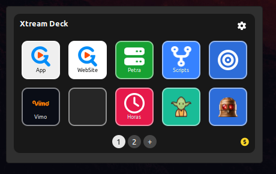
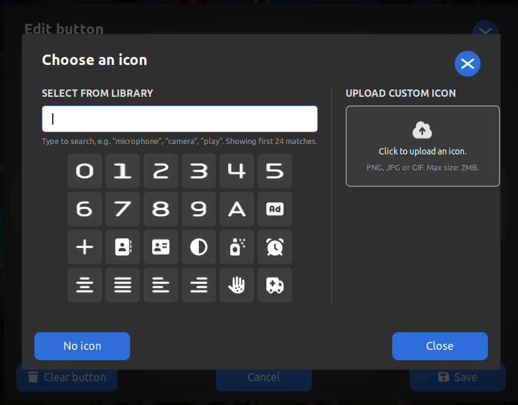

Xtream Deck
===========

A lightweight, native Stream Deck-style button grid for the Cinnamon desktop. No heavy
background app, no separate process - it's a regular Cinnamon desklet.

Each instance shows a 5x2 grid of buttons, with up to 5 pages (50 buttons total per instance).
Every button has its own label, command, icon, and background color - all configured directly
inside the panel, no external settings screen needed. Comes with the full Font Awesome Free
icon set bundled in, plus support for uploading your own PNG/JPG/GIF icons and picking any
custom hex color for a button's background.

You can add multiple instances on your desktop, each keeping its own independent configuration.

Features
--------
 - Full button editor embedded in the panel (no separate settings window)
 - Up to 5 pages per instance, 10 buttons per page
 - Bundled Font Awesome icon set with search, plus custom image upload
 - Custom background color per button (palette or hex)
 - Drag-and-drop reordering between slots

Source
------
https://github.com/sentinela-one/xtream-desklet-deck
